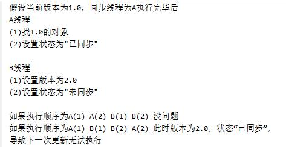

# pymssql 操作 Sql Server 

**注意在使用pymssql连接Sql Server数据库时，
若连接字符集使用utf8(charset="utf8")，那么当sql查询的字段类型为varchar且含有中文的时候需要使用encode("latin1").decode("gbk", "ignore")去处理查询结果，否则会出现乱码情况
该问题因为该字段是varchar而非nvarchar**

```python
connect = connect(charset="utf8")
cursor = connect.cursor()
sql = "INSERT INTO dbo.temp_table VALUES('测试', '测试', 2)"
sql = "SELECT * FROM temp_table" # 对于nvarchar类型结果会出现乱码
cursor.execute(sql)
connect.commit()
```


**若连接字符集使用cp936(charset="cp936")，那么查询的sql语句中含有中文的话，将会导致查询结果和预期不符合，因为cp936无法处理中文，且若查询的字段含有nvarchar会导致连接断开
但是cp936可以很好的处理varchar类型的结果不需要进行encode和decode操作**

```python
connect = connect(charset="cp936")
cursor = connect.cursor()
sql = "SELECT CONVERT(VARCHAR(500), nvarchar_field), varchar_field FROM temp_table"
cursor.execute(sql)
print(cursor.fetchall())
```


**因此推荐的做法应该是字符集采用utf8，同时含有中文的字段类型应该使用nvarchar而非varchar
或者当查询语句里面不含有中文的时候，但是结果集含有nvarchar类型同时含有中文，使用CONVERT来转换成varchar类型**

**在对sql语句中含有中文时使用utf8即可**

# 数据库查询建议

1. 对于update的数据先进行select
2. 可以使用临时表来缓存查询的结果
3. 需要大批量插入或者更新的时候，可以去考虑一次更新数万条记录写在一个sql语句中，然后循环执行该语句，比单独循环每一条sql语句的效率要高得多
4. 对于需要满足多个条件根据条件满足程度来排序的查询可以使用
    ```sql
    SELECT CONDITION_1 + CONDITION_2 + CONDITION_3 AS RANK FROM `t` ORDER BY RANK -- IF CONDITION_1 = TRUE THEN 1 ELSE 0 最终变成满足条件的个数作为rank
    ```

# 数据库设计建议

1. 可以设置一个is\_valid字段来逻辑上的删除
2. 对于频繁修改的表，可以设置update\_time以及updator来记录修改的数据，或者新增一个表来单独记录修改的数据，以便复原等操作

# 对于异常的建议

1. 应该自定义异常来描述具体的异常信息

   ```python
   class RequestException(Exception):
   	"""There was an ambiguous exception that occured while handling your request."""
   
   class AuthenticationError(RequestException):
   	"""The authentication credentials provided were invalid."""
   	
   class URLRequired(RequestException):
   	"""A valid URL is required to make a request."""
   	
   class InvalidMethod(RequestException):
   	"""An inappropriate method was attempted."""
   
   ```

   

# 对于一个可由用户扩展的功能

1. 可以设置一个全局变量，提供一个修改该全局变量的方法

   ```python
   def add_autoauth(url, authobject): # url可以替换成用户需要执行的函数，或者模块
   	"""Registers given AuthObject to given URL domain. for auto-activation.
   	Once a URL is registered with an AuthObject, the configured HTTP
   	Authentication will be used for all requests with URLS containing the given
   	URL string.
   
   	Example: ::
   	    >>> c_auth = requests.AuthObject('kennethreitz', 'xxxxxxx')
   	    >>> requests.add_autoauth('https://convore.com/api/', c_auth)
   	    >>> r = requests.get('https://convore.com/api/account/verify.json')
   	    # Automatically HTTP Authenticated! Wh00t!
   
   	:param url: Base URL for given AuthObject to auto-activate for.
   	:param authobject: AuthObject to auto-activate.
   	"""
   	global AUTOAUTHS
   	
   	AUTOAUTHS.append((url, authobject))
   ```

   

2. 根据目录结构来动态导入包

   ```python
   def async_spider():
       package = "spider"
       modules = get_modules(package) # 所有需要动态导入的模块文件名
       pool = Pool(processes=4)
       for module in modules:
           module = importlib.import_module(module, package) # 采用相对路径导入
           try:
               main_func = getattr(module, "main")
           except AttributeError as e:
               continue
           else:
               # main_func()
               pool.apply_async(main_func, tuple())
       pool.close()
       pool.join()
   ```

   

# 对于Mixin的设计

mixin的类只用于混入别的类中、不应该被实例化、没有自己的\_\_init\_\_方法、不存在实例属性，从而在被混入的类中调用super也就不涉及到调用混乱的情况了

## 原则

1. Mixin 实现的功能需要是通用的，并且是单一的，比如上例中两个 Mixin 类都适用于大部分子类，每个 Mixin 只实现一种功能，可按需继承。
2. Mixin 只用于拓展子类的功能，不能影响子类的主要功能，子类也不能依赖 Mixin。比如上例中 `Person` 继承不同的 Mixin 只是增加了一些功能，并不影响自身的主要功能。如果是依赖关系，则是真正的基类，不应该用 Mixin 命名。
3. Mixin 类自身不能进行实例化，仅用于被子类继承。

```python
In [1]: class MappingMixin:
   ...:     def __getitem__(self, key):
   ...:         return self.__dict__.get(key)
   ...:
   ...:     def __setitem__(self, key, value):
   ...:         return self.__dict__.set(key, value)
   ...:

In [2]: class ReprMixin:
   ...:     def __repr__(self):
   ...:         s = self.__class__.__name__ + '('
   ...:         for k, v in self.__dict__.items():
   ...:             if not k.startswith('_'):
   ...:                 s += '{}={}, '.format(k, v)
   ...:         s = s.rstrip(', ') + ')'  # 将最后一个逗号和空格换成括号
   ...:         return s
   ...:

In [3]: class Person(MappingMixin, ReprMixin):
   ...:     def __init__(self, name, gender, age):
   ...:         self.name = name
   ...:         self.gender = gender
   ...:         self.age = age
   ...:

In [4]: p = Person("小陈", "男", 18)
   ...: print(p['name'])  # "小陈"
   ...: print(p)  # Person(name=小陈, gender=男, age=18)
小陈
Person(name=小陈, gender=男, age=18)
```

# Python继承中使用\_\_属性的注意点

```python
In [1]: class A:
   ...:     def __init__(self, a, b):
   ...:         self._a = a
   ...:         self._b = b
   ...:

In [2]: class B(A):
   ...:     def __init__(self, a, b):
   ...:         super().__init__(a, b)
   ...:         self._a = a + 1 # 保护属性，子类会覆盖
   ...:         self._b = b + 1
   ...:

In [3]: b = B(1, 2)

In [4]: b._a
Out[4]: 2

In [5]: b._b
Out[5]: 3

In [14]: class A:
    ...:     def __init__(self, a, b):
    ...:         self.__a = a # 保护属性，子类使用__a并不会覆盖父类的该属性，而是会生成子类自己的私有属性，这一点尤其需要注意
    ...:         self.__b = b
    ...:

In [15]: class B(A):
    ...:     def __init__(self, a, b):
    ...:         super().__init__(a, b)
    ...:         self.__a = a + 1  
    ...:         self.__b = b + 1
    ...:
    ...:

In [16]: b = B(1, 2)

In [17]: b._A__a
Out[17]: 1

In [18]: b._B__a
Out[18]: 2

In [20]: b._A__b
Out[20]: 2

In [21]: b._B__b
Out[21]: 3
```

# 关于Python  \_\_del\_\_方法的说明

**不同于c++的析构函数当离开作用域时必定会调用**

1. 不能保证何时\_\_del\_\_实际调用(或在循环引用的情况下是否完全调用)当解释器退出时不会确保为仍然存在的对象调用 \_\_del\_\_() 方法。

2. \_\_del\_\_() 可以在解释器关闭阶段被执行。因此，它需要访问的全局变量（包含其他模块）可能已被删除或设为 None。

   ```python
   In [1]: class T:
      ...:     def __del__(self):
      ...:         self.file.close()  # 可能init的时候self.file没有被成功赋值，导致没有该属性，抛出异常
      ...:         open("temp.txt", "w")  # 可能open已经被删除或者设为None，将抛出异常
      ...:
   ```

   

3. \_\_del\_\_() 可在任意代码被执行时启用，包括来自任意线程的代码。如果 \_\_del_\_() 需要接受锁或启用其他阻塞资源，可能会发生死锁

4. 由于不能保证它会被执行，因此永远不要将您需要运行的代码放入其中\_\_del\_\_()
## 更好的写法为

```python

import atexit


class Package:
    def __init__(self):
        self.files = []
        atexit.register(self.cleanup)

    def cleanup(self):
        print("Running cleanup...")
        for file in self.files:
            print("Unlinking file: {}".format(file))
```

# 乐观锁

独占锁是一种悲观锁，synchronized就是一种独占锁，它假设最坏的情况，并且只有在确保其它线程不会造成干扰的情况下执行，会导致其它所有需要锁的线程挂起，等待持有锁的线程释放锁。而另一个更加有效的锁就是乐观锁。所谓乐观锁就是，每次不加锁而是假设没有冲突而去完成某项操作，如果因为冲突失败就重试，直到成功为止。

要实现无锁（lock-free）的非阻塞算法有多种实现方法，其中[CAS（比较与交换，Compare and swap）](http://en.wikipedia.org/wiki/Compare-and-swap)是一种有名的无锁算法。CAS, CPU指令，在大多数处理器架构，包括IA32、Space中采用的都是CAS指令，CAS的语义是“我认为V的值应该为A，如果是，那么将V的值更新为B，否则不修改并告诉V的值实际为多少”，CAS是项**乐观锁**技术，当多个线程尝试使用CAS同时更新同一个变量时，只有其中一个线程能更新变量的值，而其它线程都失败，失败的线程并不会被挂起，而是被告知这次竞争中失败，并可以再次尝试。CAS有3个操作数，内存值V，旧的预期值A，要修改的新值B。当且仅当预期值A和内存值V相同时，将内存值V修改为B，否则什么都不做。CAS无锁算法的C实现如下：

```c
int compare_and_swap (int* reg, int oldval, int newval) 
{
  ATOMIC();
  int old_reg_val = *reg;
  if (old_reg_val == oldval) 
     *reg = newval;
  END_ATOMIC();
  return old_reg_val;
}
```

就是指当两者进行比较时，如果相等，则证明共享数据没有被修改，替换成新值，然后继续往下运行；如果不相等，说明共享数据已经被修改，放弃已经所做的操作，然后重新执行刚才的操作。容易看出 CAS 操作是基于共享数据不会被修改的假设，采用了类似于数据库的 commit-retry 的模式。当同步冲突出现的机会很少时，这种假设能带来较大的性能提升。


